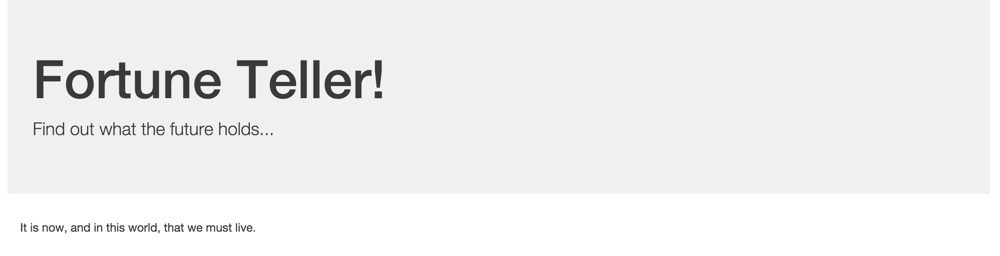
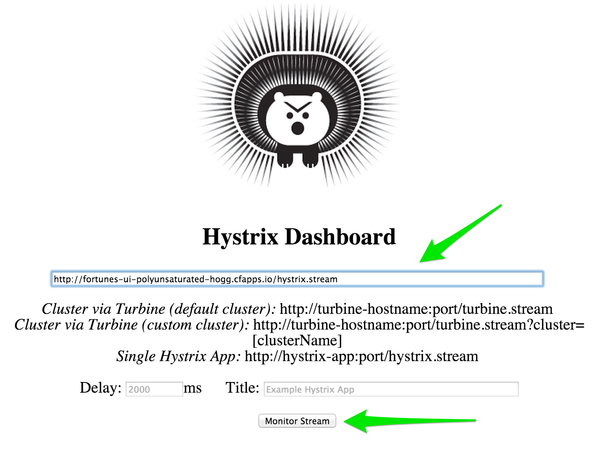
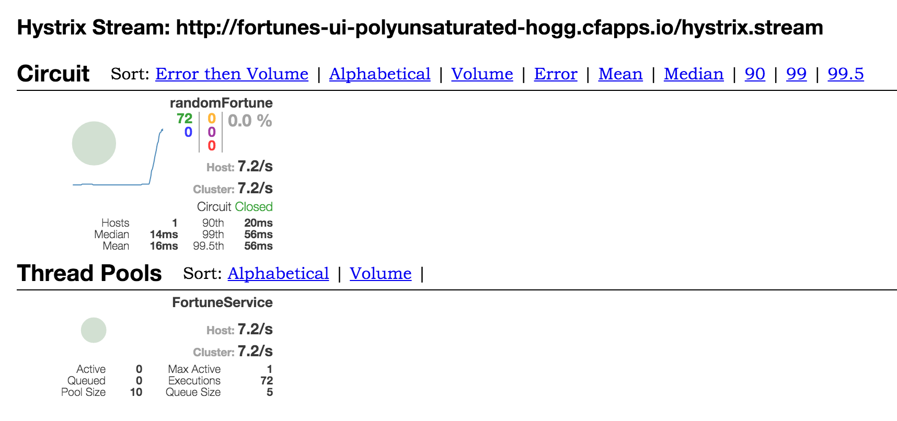
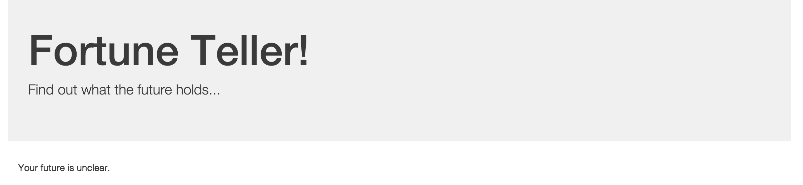

= Fortune Teller

*Fortune Teller* is a very basic application composed of two services:

. link:fortune-teller-fortune-service[Fortune Service] - serves up random Chinese fortune cookie fortunes
. link:fortune-teller-ui[Fortune UI] - presents a UI that consumes the fortune service

It leverages libraries and services from Spring Cloud and Netflix OSS to compose the system.

NOTE: Want to deploy Fortune Teller to Pivotal Cloud Foundry environments that have installed the https://network.pivotal.io/products/p-spring-cloud-services[Spring Cloud Services] package? See the link:https://github.com/spring-cloud-services-samples/fortune-teller[SCS version of Fortune Teller].

== Build

. Using Maven, build and package the application:
+
----
$ mvn clean package
----
+
Maven will automatically download all of _Fortune Teller_'s dependencies. This may take a few moments.

== Run

. Start the Config Server
+
----
$ cd fortune-teller-config-server
$ mvn spring-boot:run
----

. Start the Eureka Service
+
----
$ cd fortune-teller-eureka
$ mvn spring-boot:run
----

. Start the Hystrix Dashboard
+
----
$ cd fortune-teller-hystrix-dashboard
$ mvn spring-boot:run
----

. Start the Fortunes Service
+
----
$ cd fortune-teller-fortune-service
$ mvn spring-boot:run
----

. Start the Fortunes UI
+
----
$ cd fortune-teller-ui
$ mvn spring-boot:run
----

== Test the Application

. In a browser, access the fortunes-ui application at http://localhost:8081/
+

. Now, in another browser tab, access the Hystrix Dashboard at http://localhost:7979/hystrix/. Enter the route for the UI application, `http://localhost:8081/hystrix.stream`, and click the ``Monitor Stream.''
+

. Access the fortunes-ui and show that the circuit breaker is registering successful requests.
+

. Stop the fortunes application

. Access the fortunes-ui and see that the ``fallback fortune'' is being returned.
+

. Access the fortunes-ui and show that the circuit breaker is registering short-circuited requests.
+
image:docs/images/fortunes_5.png[]

. Restart the fortunes application

. Continue to access the fortunes-ui and watch the dashboard.
After the fortunes service has re-registered with Eureka and the fortunes-ui load balancer caches are refreshed, you will see the circuit breaker recover.
You should then start getting random fortunes again!
